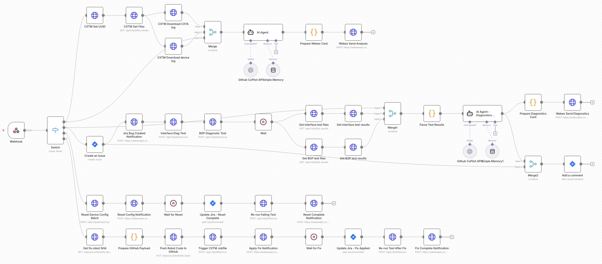

# System Architecture

## Overview

```
┌─────────────┐     ┌─────────────┐     ┌─────────────┐
│    CXTM     │────▶│  Webex Bot  │────▶│    n8n      │
│  (Tests)    │     │  (Node.js)  │     │ (Workflow)  │
└─────────────┘     └─────────────┘     └─────────────┘
                           │                   │
                           ▼                   ▼
                    ┌─────────────┐     ┌─────────────┐
                    │   Webex     │     │   GitHub    │
                    │  (Cards)    │     │  Copilot    │
                    └─────────────┘     └─────────────┘
                                              │
                                              ▼
                                       ┌─────────────┐
                                       │    Jira     │
                                       │  (Tickets)  │
                                       └─────────────┘
```

### n8n Workflow Visualization



## Flow Description

### 1. Test Failure Detection

1. CXTM runs automated tests against network devices
2. When a test fails, CXTM sends a notification to a Webex space
3. The Webex Bot detects the `@mention` with test results
4. Bot extracts test metadata (project ID, testcase ID, result status)

### 2. Initial AI Analysis (Flow 0: test_failure)

1. n8n webhook receives test failure data
2. Fetches device logs and CXTA logs from CXTM
3. GitHub Copilot AI analyzes logs for root cause
4. Sends Adaptive Card to Webex with analysis and "Create Jira" button

### 3. Diagnostic Tests (Flow 1: create_jira)

1. User clicks "Create Jira Ticket" in Webex
2. n8n creates Jira issue with AI analysis
3. Triggers Interface and BGP diagnostic batches in CXTM
4. Waits for diagnostic tests to complete
5. AI analyzes diagnostic results and generates Robot Framework fix code
6. Sends Diagnostics Card with "Apply Fix" and "Reset Device" buttons

### 4. Device Reset (Flow 2: reset_device_config)

1. User clicks "Reset Device Config"
2. n8n triggers CXTM batch to reset device to Day0 config
3. Updates Jira ticket
4. Re-runs the original failing test
5. Notifies user in Webex

### 5. Apply AI Fix (Flow 3: apply_fix)

1. User clicks "Apply Recommended Fix"
2. n8n pushes AI-generated Robot code to GitHub
3. Triggers CXTM jobfile to run the fix
4. Updates Jira ticket
5. Re-runs the original failing test
6. Notifies user in Webex

## Components

### Webex Bot (Node.js)

- **Framework**: webex-node-bot-framework
- **Purpose**: Bridge between Webex and n8n
- **Functions**:
  - Listen for @mentions with test results
  - Handle Adaptive Card button clicks
  - Forward data to n8n webhooks

### n8n Workflow

- **Nodes**: ~40 nodes across 4 flows
- **AI**: GitHub Copilot via OpenAI-compatible API
- **Integrations**: CXTM, Webex, Jira, GitHub

### CXTM

- **Test Batches**: Interface diagnostics, BGP diagnostics, Device reset
- **Jobfiles**: Apply AI-generated fixes
- **API**: REST API with X-TM2-API-KEY authentication

## Data Flow

```
Test Failure → Webex → Bot → n8n → AI Analysis → Webex Card
                                        ↓
User Action → Bot → n8n → Jira + Diagnostics → AI → Fix Code
                                        ↓
                              GitHub → CXTM → Device → Re-test
```

## Security Considerations

- All API keys stored as environment variables
- Webex bot token never exposed in logs
- n8n credentials encrypted in database
- GitHub tokens scoped to specific repository
